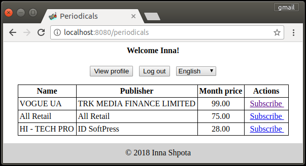
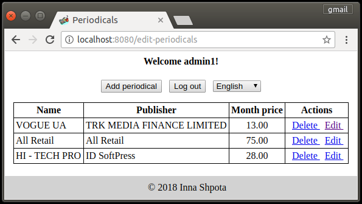

Periodicals
=================

## Web application that allows to subscribe on periodicals

The application is based on Servlets, JSP + JSTL, JDBC, HTML + CSS and LOG4J 
as a logging system. The code is covered with unit tests using JUnit and Mockito.

## Environment Setup

The application requires:

- JDK 1.8
- Maven 4.0.0 or above
- Docker 17.05.0

## How to run

1. Build docker image for database

    ```
    docker build -t periodicals:periodicals-db -f Dockerfile.mysql .
    ```
    
2. Run the database 

    ```
    docker run -p 3306:3306 -e MYSQL_USER=periodicals -e MYSQL_PASSWORD=periodicals -e MYSQL_DATABASE=periodicals --name periodicals_db periodicals:periodicals-db
    ```

    The following commands must be performed in separate terminal session.

3. Build war-archive with the application 

    ```
    mvn clean package
    ```
4. Build web-server image

    ```
    docker build -t periodicals:periodicals-web -f Dockerfile.web .
    ```

5. Run the web server with the application 

    ```
    docker run -it --rm -p 8080:8080 --name periodicals_web --link periodicals_db  periodicals:periodicals-web
    ```

The application is accessable via http://localhost:8080/.

Use **admin1/admin1** as _username/password_ to admin login.

## Interface

Main page of the application


Sign up page


Reader log in page


Reader main page



Subscribe page


Payment page


Profile page


Admin log in page


Admin main page



Admin periodicals page


Create a new periodical


Edit page

